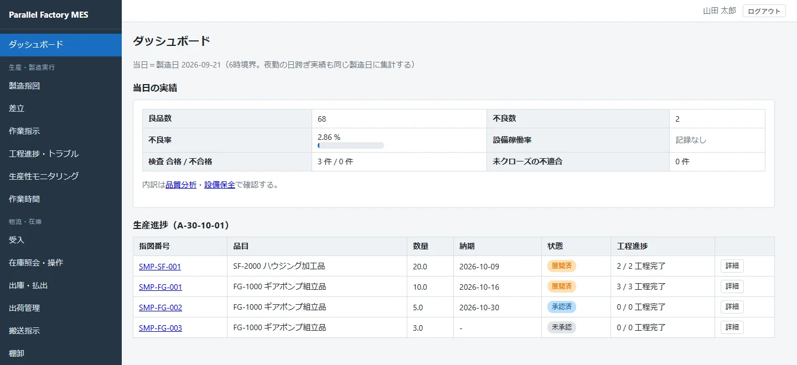

## Parallel Factory MES とは

工場の製造実績を記録・追跡するためのシステム（MES）です。ブラウザだけで利用でき、
現場PC・タブレットからそのまま操作できます。

- **製造指図から出荷までを一本の流れで管理**します。製造指図 → 工程ごとの作業指示 → 実績 → 在庫 → 検査 → 出荷判定 → 出荷。
- **ロット単位で追跡**します。どの部材ロットからどの製品ロットができたかを、双方向にたどれます。
- **記録には必ず「誰が・いつ」が残ります**。実績訂正・検査訂正・マスタ変更・在庫操作・取消は監査ログに記録され、[監査ログ画面](operations.html#audit-log)（システム管理者専用）で確認できます。

<a class="intro-banner" href="intro.html">
  
  <strong>まずは紹介ページで全体を見る &rarr;</strong><small>製造指図から出荷までの流れと主な画面を、画面写真でひととおり紹介しています。</small>
</a>

## ガイドの読みかた

  <a href="getting-started.html"><strong>はじめて使う方</strong><small>システムの起動、初期管理者の作成、ログインまで</small></a>
  <a href="masters.html"><strong>導入担当の方</strong><small>工程・品目・工順など、最初に登録すべきマスタ</small></a>
  <a href="execution.html"><strong>現場作業者の方</strong><small>作業指示の確認、段取り記録、実績入力</small></a>
  <a href="logistics.html"><strong>倉庫・物流担当の方</strong><small>受入、在庫操作、出庫・払出、出荷、棚卸</small></a>
  <a href="quality.html"><strong>品質管理担当の方</strong><small>検査指示・実績・判定、不適合対応</small></a>
  <a href="assurance.html"><strong>品質保証担当の方</strong><small>出荷判定、ロットトレーサビリティ</small></a>

## 業務の全体像

導入直後は、次の順番で進めるとスムーズです。

  マスタ登録<em>→</em>
  受入（部材在庫）<em>→</em>
  製造指図<em>→</em>
  工程展開<em>→</em>
  差立<em>→</em>
  段取り<em>→</em>
  実績入力<em>→</em>
  完了承認<em>→</em>
  検査<em>→</em>
  出荷判定<em>→</em>
  出荷

| ステップ | 画面 | 担当ロールの例 | 解説 |
|---|---|---|---|
| マスタ登録 | マスタ管理 | システム管理者／生産管理 | [マスタ管理](masters.html) |
| 受入 | 受入 | 物流・倉庫 | [物流・在庫管理](logistics.html) |
| 生産計画の登録・予実 | 生産計画・予実 | 生産管理 | [生産管理](production.html#plan) |
| 製造指図・承認・工程展開 | 製造指図 | 生産管理 | [生産管理](production.html) |
| 差立・段取り・実績・完了承認 | 差立／作業指示 | 生産管理／現場作業者 | [製造実行](execution.html) |
| 検査・不適合 | 検査管理／不適合管理 | 品質管理 | [品質管理](quality.html) |
| 出荷判定・トレース | 出荷判定／トレーサビリティ | 品質保証 | [品質保証](assurance.html) |
| 出荷 | 出荷管理 | 物流・倉庫 | [物流・在庫管理](logistics.html) |
| 設備・治工具 | 設備保全／治工具管理 | 設備保全 | [設備保全・治工具](maintenance.html) |

この流れをサンプルデータ（ギアポンプ10台の製造から出荷まで）に沿って図と画面写真でたどるページが
[サンプルで見る 製造から出荷まで](walkthrough.html) です。

## このバージョンでできること

- 生産管理（生産計画の受け取りと予実・製造指図・工程展開・進捗）
- 製造実行（差立・段取り・チェックリスト・実績・トラブル報告）
- 物流／在庫管理（受入・在庫操作・出庫／払出・出荷・棚卸）
- 品質管理（検査指示・実績・判定・不適合）
- 品質保証（出荷判定・トレーサビリティ）
- 設備保全（稼働記録・保全計画／指示／実績・手順書）と治工具寿命管理
- 帳票・ラベル出力、バーコード／QRスキャン
- データベースは SQLite（既定）・PostgreSQL・SQL Server から選択
- 配布は Microsoft Store 版（1台で試す）・ZIP（Windows / Linux）・Docker の3通り（[導入と初期設定](getting-started.html)）

<strong>用語やステータスの意味を調べたいとき</strong>は<a href="reference.html">リファレンス</a>を、
<strong>エラーが出て先に進めないとき</strong>は<a href="troubleshooting.html">困ったときは</a>をご覧ください。

## 開発のサポート

Parallel Factory MES は個人で開発しています。開発を続けるための寄付を
[GitHub Sponsors](https://github.com/sponsors/msmsrep) と [Ko-fi](https://ko-fi.com/msmsrep) で受け付けています。
寄付による機能の追加や制限の解除はなく、すべての機能はこれまでどおり無償で使えます。
