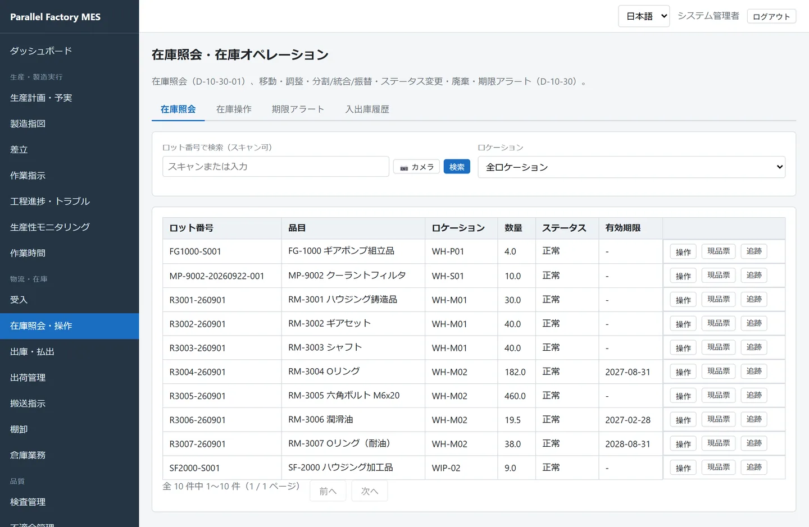
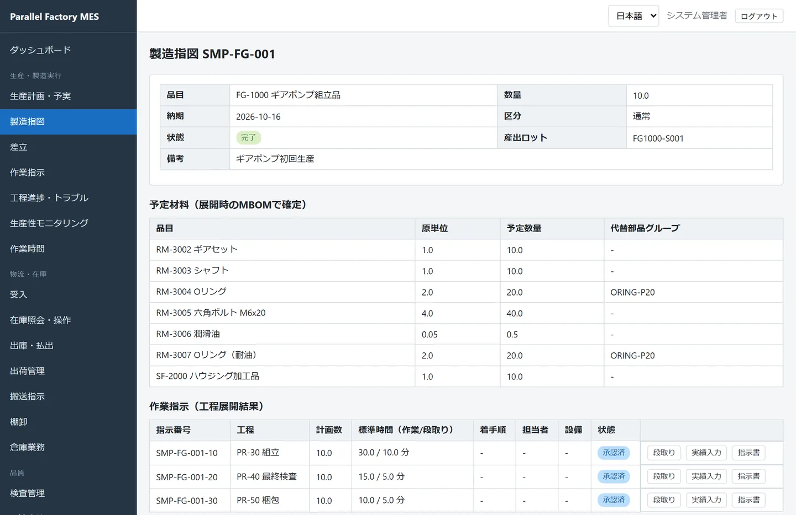
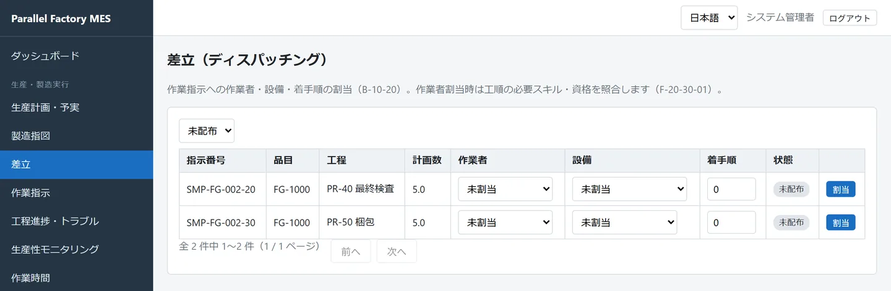
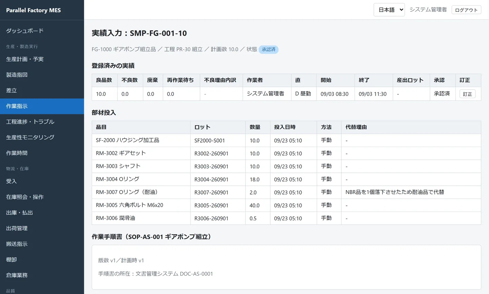
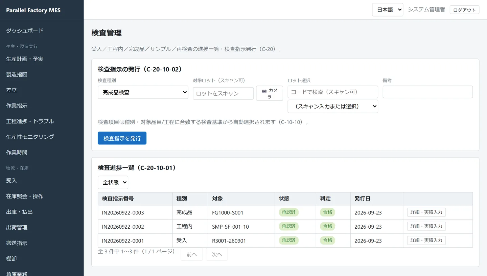
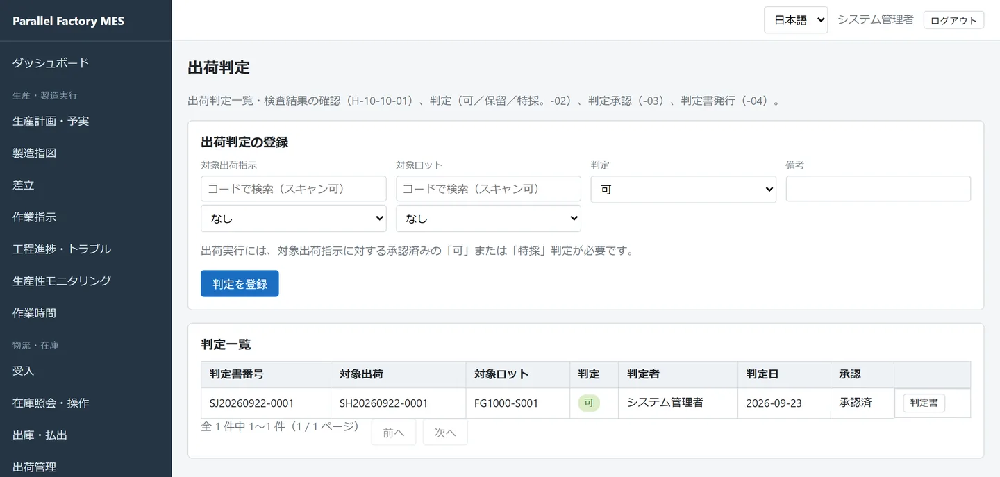
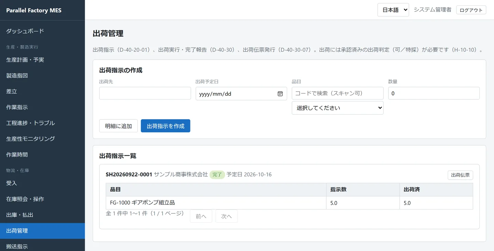
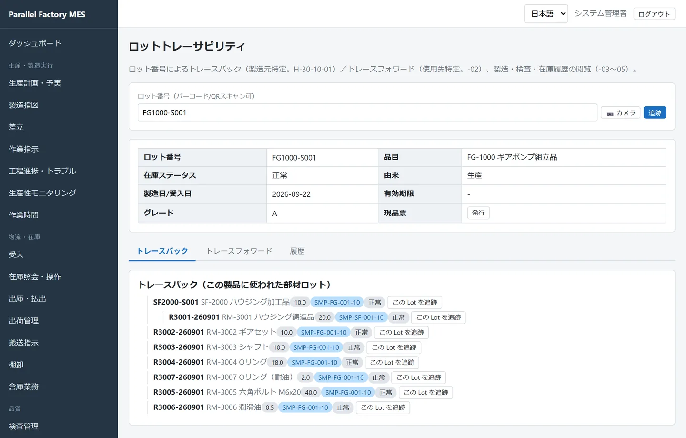

<strong>このページの内容は、そのまま手元で再現できます。</strong>
<code>samples/master-csv</code> と <code>samples/actual-csv</code> のCSVをそれぞれZIPにまとめ、
画面上部の <strong>ZIPで一括取込</strong> から、マスタ、実績の順に取り込んでください。
CSVに含まれない操作（完了承認・検査承認など）は、<a href="#try">最後の章</a>にまとめてあります。

## 1. 全体の流れ  {#overview}

ここで追う題材は、**ギアポンプ FG-1000 を10台作る製造指図 SMP-FG-001** です。
ギアポンプの外側にあたるハウジングは、前工程の **製造指図 SMP-SF-001** で、鋳造品を削り、表面処理をして作ります。

部材の受入から出荷まで、次の10の段階があります。担当するロールを、図の横の帯（レーン）で分けています。

<figure class="fig">

<svg viewBox="0 0 960 296" role="img" aria-label="受入から出荷までの10段階と担当ロール">
<defs><marker id="a1" viewBox="0 0 10 10" refX="9" refY="5" markerWidth="7" markerHeight="7" orient="auto-start-reverse"><path class="head" d="M0 0L10 5L0 10z"/></marker></defs>
<rect class="lane" x="0" y="10" width="960" height="64"/>
<rect class="lane" x="0" y="150" width="960" height="64"/>
<text class="tb" x="14" y="38">生産管理</text><text class="m" x="14" y="56">pm001</text>
<text class="tb" x="14" y="108">物流・倉庫</text><text class="m" x="14" y="126">lg001</text>
<text class="tb" x="14" y="178">現場作業者</text><text class="m" x="14" y="196">op001〜003</text>
<text class="tb" x="14" y="248">品質</text><text class="m" x="14" y="266">qc001</text>
<g text-anchor="middle">
<rect class="lg" x="120" y="90" width="70" height="44" rx="6"/><text class="m" x="126" y="87" text-anchor="start">1</text><text class="t" x="155" y="109">受入</text><text class="m" x="155" y="125">部材ロット</text>
<rect class="pm" x="202" y="20" width="70" height="44" rx="6"/><text class="m" x="208" y="17" text-anchor="start">2</text><text class="t" x="237" y="39">製造指図</text><text class="m" x="237" y="55">登録・承認</text>
<rect class="pm" x="284" y="20" width="70" height="44" rx="6"/><text class="m" x="290" y="17" text-anchor="start">3</text><text class="t" x="319" y="39">工程展開</text><text class="m" x="319" y="55">作業指示へ</text>
<rect class="pm" x="366" y="20" width="70" height="44" rx="6"/><text class="m" x="372" y="17" text-anchor="start">4</text><text class="t" x="401" y="39">差立</text><text class="m" x="401" y="55">人と設備</text>
<rect class="op" x="448" y="160" width="70" height="44" rx="6"/><text class="m" x="454" y="157" text-anchor="start">5</text><text class="t" x="483" y="179">段取り</text><text class="m" x="483" y="195">点検</text>
<rect class="op" x="530" y="160" width="70" height="44" rx="6"/><text class="m" x="536" y="157" text-anchor="start">6</text><text class="t" x="565" y="179">投入・実績</text><text class="m" x="565" y="195">良品・不良</text>
<rect class="pm" x="612" y="20" width="70" height="44" rx="6"/><text class="m" x="618" y="17" text-anchor="start">7</text><text class="t" x="647" y="39">完了承認</text><text class="m" x="647" y="55">実績の確定</text>
<rect class="qc" x="694" y="230" width="70" height="44" rx="6"/><text class="m" x="700" y="227" text-anchor="start">8</text><text class="t" x="729" y="249">検査</text><text class="m" x="729" y="265">合否判定</text>
<rect class="qc" x="776" y="230" width="70" height="44" rx="6"/><text class="m" x="782" y="227" text-anchor="start">9</text><text class="t" x="811" y="249">出荷判定</text><text class="m" x="811" y="265">可・承認</text>
<rect class="lg" x="858" y="90" width="70" height="44" rx="6"/><text class="m" x="864" y="87" text-anchor="start">10</text><text class="t" x="893" y="109">出荷</text><text class="m" x="893" y="125">在庫引落し</text>
</g>
<g class="ln" marker-end="url(#a1)">
<path d="M190 112H196V42H201"/><path d="M272 42H283"/><path d="M354 42H365"/><path d="M436 42H442V182H447"/>
<path d="M518 182H529"/><path d="M600 182H606V42H611"/><path d="M682 42H688V252H693"/><path d="M764 252H775"/><path d="M846 252H852V112H857"/>
</g>
</svg>

<figcaption>図1　10の段階と、それぞれを担当するロール</figcaption>
</figure>

生産管理物流・倉庫現場作業者品質管理・品質保証

| # | 段階 | 使う画面 | このページの例 |
|---|---|---|---|
| 1 | 受入 | 物流・在庫 → 受入 | 鋳造品 R3001-260901 を50個 |
| 2〜3 | 製造指図・工程展開 | 生産・製造実行 → 製造指図 | SMP-FG-001（10台）→ 作業指示3件 |
| 4 | 差立 | 生産・製造実行 → 差立 | SMP-FG-002 の作業指示に作業者と設備を割り当てる |
| 5〜6 | 段取り・実績入力 | 作業指示 → 段取り／実績入力 | 組立で10台、梱包で良品9・不良1 |
| 7 | 完了承認 | 実績入力（製造完了承認） | 3件の作業指示を「承認済」に |
| 8 | 検査 | 品質 → 検査管理 | 完成品検査で吐出量 20.3 L/min、合格 |
| 9 | 出荷判定 | 品質 → 出荷判定 | 「可」と判定して承認 |
| 10 | 出荷 | 物流・在庫 → 出荷管理 | サンプル商事へ5台 |

---

## 2. 工場と人  {#plant}

サンプルの工場は、**第1工場（PL-1）** の1つです。工場 → ライン → エリア → 作業区の4段で構成され、
設備・置場（ロケーション）・作業者は、それぞれどこかの段に所属しています。

<figure class="fig">

<svg viewBox="0 0 960 372" role="img" aria-label="作業区の階層と、所属する設備・置場・作業者">
<text class="m" x="8" y="42">工場</text><text class="m" x="8" y="122">ライン</text><text class="m" x="8" y="202">エリア</text><text class="m" x="8" y="276">作業区</text>
<g class="ln"><path d="M480 60V78"/><path d="M150 78H740"/><path d="M150 78V96"/><path d="M400 78V96"/><path d="M740 78V96"/>
<path d="M150 140V176"/><path d="M400 140V176"/><path d="M740 140V158H640V176"/><path d="M740 158H840V176"/>
<path d="M150 220V250"/><path d="M400 220V250"/><path d="M640 220V250"/><path d="M840 220V250"/></g>
<g text-anchor="middle">
<rect class="box" x="390" y="14" width="180" height="46" rx="8"/><text class="tb" x="480" y="35">第1工場</text><text class="m" x="480" y="51">PL-1</text>
<rect class="box" x="70" y="96" width="160" height="44" rx="8"/><text class="tb" x="150" y="116">加工ライン</text><text class="m" x="150" y="132">LN-MC</text>
<rect class="box" x="320" y="96" width="160" height="44" rx="8"/><text class="tb" x="400" y="116">組立ライン</text><text class="m" x="400" y="132">LN-AS</text>
<rect class="box" x="660" y="96" width="160" height="44" rx="8"/><text class="tb" x="740" y="116">物流・品質</text><text class="m" x="740" y="132">LN-LG</text>
<rect class="box" x="70" y="176" width="160" height="44" rx="8"/><text class="tb" x="150" y="196">加工エリア</text><text class="m" x="150" y="212">AR-MC</text>
<rect class="box" x="320" y="176" width="160" height="44" rx="8"/><text class="tb" x="400" y="196">組立エリア</text><text class="m" x="400" y="212">AR-AS</text>
<rect class="box" x="560" y="176" width="160" height="44" rx="8"/><text class="tb" x="640" y="196">検査室</text><text class="m" x="640" y="212">AR-QC</text>
<rect class="box" x="760" y="176" width="160" height="44" rx="8"/><text class="tb" x="840" y="196">出荷エリア</text><text class="m" x="840" y="212">AR-SH</text>
<rect class="op" x="70" y="250" width="160" height="44" rx="8"/><text class="tb" x="150" y="270">マシニング加工</text><text class="m" x="150" y="286">WC-MC1</text>
<rect class="op" x="320" y="250" width="160" height="44" rx="8"/><text class="tb" x="400" y="270">ポンプ組立</text><text class="m" x="400" y="286">WC-AS1</text>
<rect class="qc" x="560" y="250" width="160" height="44" rx="8"/><text class="tb" x="640" y="270">最終検査</text><text class="m" x="640" y="286">WC-QC1</text>
<rect class="op" x="760" y="250" width="160" height="44" rx="8"/><text class="tb" x="840" y="270">梱包</text><text class="m" x="840" y="286">WC-PK1</text>
<text class="m" x="150" y="316">設備 EQ-01・EQ-05</text><text class="m" x="150" y="334">置場 WIP-01</text><text class="m c-op" x="150" y="352">op001（昼勤）・op003（夜勤）</text>
<text class="m" x="400" y="316">設備 EQ-02</text><text class="m" x="400" y="334">置場 WIP-02</text><text class="m c-op" x="400" y="352">op002</text>
<text class="m" x="640" y="316">設備 EQ-03（三次元測定機）</text><text class="m c-qc" x="640" y="334">qc001</text>
<text class="m" x="840" y="316">設備 EQ-04（真空包装機）</text><text class="m" x="840" y="334">置場 SHIP-01（出荷エリア）</text><text class="m c-lg" x="840" y="352">lg001（出荷エリア）</text>
</g>
<text class="m" x="590" y="28">置場　WH-M01・WH-M02（部材倉庫）</text>
<text class="m" x="590" y="44">　　　WH-S01（保全部品棚）・WH-P01（製品倉庫）</text>
<text class="m" x="590" y="60">人　　pm001 生産管理・mt001 保全</text>
</svg>

<figcaption>図2　作業区の階層（マスタ管理 → 作業区）と、各段に所属する設備・置場・作業者</figcaption>
</figure>

| ユーザー | 氏名 | ロール | このページでの役目 |
|---|---|---|---|
| pm001 | 生産 管理太郎 | 生産管理 | 製造指図の登録・承認・工程展開、差立、完了承認 |
| lg001 | 物流 四郎 | 物流 | 部材の受入、出荷指示と出荷 |
| op001 / op003 | 加工 一郎 / 加工 三平 | 現場作業者 | ハウジングの機械加工（op003 は夜勤） |
| op002 | 組立 二郎 | 現場作業者 | ギアポンプの組立・梱包 |
| qc001 | 品質 三子 | 品質管理・品質保証 | 検査、出荷判定 |

勤務シフトは **昼勤 D（8:00〜17:00）** と、日をまたぐ **夜勤 N（20:00〜翌5:00）** の2つです。
実績は開始時刻でどちらの直かが決まります。
詳しくは [マスタ管理](masters.html) をご覧ください。

---

## 3. 何を、どう作るか  {#product}

ギアポンプ FG-1000 は、自社で作るハウジング加工品 SF-2000 と、5種類の購入部材を組み立てて作ります。
品目どうしの親子関係を **MBOM（部品構成）**、工程の並びを **工順** と呼びます。

<figure class="fig">

<svg viewBox="0 0 960 380" role="img" aria-label="SF-2000とFG-1000の部品構成と工順">
<defs><marker id="a3" viewBox="0 0 10 10" refX="9" refY="5" markerWidth="7" markerHeight="7" orient="auto-start-reverse"><path class="head" d="M0 0L10 5L0 10z"/></marker></defs>
<text class="tb" x="20" y="24">ハウジング加工品 SF-2000 を作る（製造指図 SMP-SF-001・20個）</text>
<g text-anchor="middle">
<rect class="card" x="20" y="40" width="150" height="56" rx="8"/><text class="tb" x="95" y="62">RM-3001</text><text class="t" x="95" y="82">ハウジング鋳造品</text>
<rect class="op" x="210" y="40" width="160" height="56" rx="8"/><text class="tb" x="290" y="62">PR-10 機械加工</text><text class="m" x="290" y="82">WC-MC1・標準25分</text>
<rect class="op dash" x="400" y="40" width="160" height="56" rx="8"/><text class="tb" x="480" y="62">PR-20 表面処理</text><text class="m" x="480" y="82">外注（アルマイト）</text>
<rect class="card" x="600" y="40" width="160" height="56" rx="8"/><text class="tb" x="680" y="62">SF-2000</text><text class="t" x="680" y="82">ハウジング加工品</text>
<text class="m c-qc" x="95" y="116">受入検査 INS-03</text>
<text class="m c-qc" x="290" y="116">工程内検査 INS-01・02</text><text class="m" x="290" y="132">条件 主軸回転数・送り速度</text>
<text class="m" x="480" y="116">外注先で処理</text>
</g>
<g class="ln" marker-end="url(#a3)"><path d="M170 68H206"/><path d="M370 68H396"/><path d="M560 68H596"/><path d="M760 68H790V176H155V185"/></g>
<text class="tb" x="20" y="164">ギアポンプ FG-1000 を作る（製造指図 SMP-FG-001・10台）</text>
<rect class="card" x="20" y="186" width="270" height="180" rx="8"/>
<text class="tb" x="34" y="208">MBOM（1台あたり）</text>
<text class="t" x="34" y="232">SF-2000 ハウジング加工品 ×1</text>
<text class="t" x="34" y="252">RM-3002 ギアセット ×1</text>
<text class="t" x="34" y="272">RM-3003 シャフト ×1</text>
<text class="t" x="34" y="292">RM-3004 Oリング ×2</text>
<text class="m" x="46" y="310">└ 代替 RM-3007 Oリング（耐油）</text>
<text class="t" x="34" y="332">RM-3005 六角ボルト M6x20 ×4</text>
<text class="t" x="34" y="352">RM-3006 潤滑油 ×0.05 L</text>
<g text-anchor="middle">
<rect class="op" x="330" y="248" width="150" height="56" rx="8"/><text class="tb" x="405" y="270">PR-30 組立</text><text class="m" x="405" y="290">WC-AS1・標準30分</text>
<rect class="qc" x="510" y="248" width="150" height="56" rx="8"/><text class="tb" x="585" y="270">PR-40 最終検査</text><text class="m" x="585" y="290">WC-QC1・標準15分</text>
<rect class="op" x="690" y="248" width="130" height="56" rx="8"/><text class="tb" x="755" y="270">PR-50 梱包</text><text class="m" x="755" y="290">WC-PK1・標準10分</text>
<rect class="card" x="850" y="248" width="100" height="56" rx="8"/><text class="tb" x="900" y="270">FG-1000</text><text class="t" x="900" y="290">ギアポンプ</text>
<text class="m" x="405" y="324">条件 締付トルク</text><text class="m" x="405" y="340">点検 CL-02</text>
<text class="m c-qc" x="585" y="324">完成品検査 INS-04・05</text><text class="m" x="585" y="340">条件 試験圧力</text>
<text class="m" x="755" y="324">点検 CL-03</text>
<text class="m" x="900" y="324">入庫 WH-P01</text>
</g>
<g class="ln" marker-end="url(#a3)"><path d="M290 276H326"/><path d="M480 276H506"/><path d="M660 276H686"/><path d="M820 276H846"/></g>
</svg>

<figcaption>図3　部品構成（MBOM）と工順。破線の枠は外注工程、紫の文字は検査のタイミング</figcaption>
</figure>

- **Oリングには代替部品があります。** 通常は RM-3004（NBR）を使いますが、同じ代替グループ `ORING-P20` の RM-3007（耐油 FKM）でも代用できます。
- **工順の各工程に、作業区・候補設備・治工具・必要スキル・チェックリスト・製造条件が結び付いています。** たとえば PR-10 では、マシニングセンタ（EQ-01／EQ-05）、エンドミル TL-01、スキル SK-01「マシニングセンタ操作」、始業前点検 CL-01 が使われます。
- 最終工程（FG-1000 なら PR-50 梱包）の良品が、製品のロットとして在庫に入ります。

MBOMと工順の登録方法は、[マスタ管理の品目・MBOM・工順](masters.html) をご覧ください。

---

## 4. 部材を受け入れる  {#receiving}

**担当：物流（lg001）　画面：物流・在庫 → 受入**

仕入先から届いた部材を、**ロット**として倉庫に登録します。以降の在庫・投入・追跡は、すべてこのロット番号でつながります。

<figure class="fig">

<svg viewBox="0 0 960 326" role="img" aria-label="受入した部材ロットと置場">
<defs><marker id="a4" viewBox="0 0 10 10" refX="9" refY="5" markerWidth="7" markerHeight="7" orient="auto-start-reverse"><path class="head" d="M0 0L10 5L0 10z"/></marker></defs>
<rect class="lg" x="10" y="124" width="140" height="80" rx="8"/>
<g text-anchor="middle"><text class="tb" x="80" y="152">受入</text><text class="m" x="80" y="170">lg001 が登録</text><text class="m" x="80" y="186">受入画面／CSV</text></g>
<g class="ln" marker-end="url(#a4)"><path d="M150 164H165V58H177"/><path d="M150 164H177"/><path d="M165 164V270H177"/></g>
<rect class="box" x="180" y="10" width="770" height="96" rx="8"/><text class="tb" x="194" y="32">WH-M01　部材倉庫（棚 A-01-01）</text>
<rect class="box" x="180" y="116" width="770" height="96" rx="8"/><text class="tb" x="194" y="138">WH-M02　部材倉庫（棚 A-01-02）</text>
<rect class="box" x="180" y="222" width="770" height="96" rx="8"/><text class="tb" x="194" y="244">WH-S01　保全部品棚（棚 M-01-01）</text>
<rect class="card" x="194" y="42" width="175" height="56" rx="6"/><text class="tb" x="204" y="60">R3001-260901</text><text class="m" x="204" y="76">ハウジング鋳造品 50個</text>
<rect class="card" x="379" y="42" width="175" height="56" rx="6"/><text class="tb" x="389" y="60">R3002-260901</text><text class="m" x="389" y="76">ギアセット 50セット</text>
<rect class="card" x="564" y="42" width="175" height="56" rx="6"/><text class="tb" x="574" y="60">R3003-260901</text><text class="m" x="574" y="76">シャフト 50本</text>
<rect class="qc" x="749" y="42" width="190" height="56" rx="6"/><text class="tb" x="759" y="60">受入検査 INS-03</text><text class="m" x="759" y="76">R3001 の外観 → 合格</text><text class="m" x="759" y="91">巣・欠けなし</text>
<rect class="card" x="194" y="148" width="175" height="56" rx="6"/><text class="tb" x="204" y="166">R3004-260901</text><text class="m" x="204" y="182">Oリング 200個</text><text class="m" x="204" y="197">期限 2027-08-31</text>
<rect class="card" x="379" y="148" width="175" height="56" rx="6"/><text class="tb" x="389" y="166">R3007-260901</text><text class="m" x="389" y="182">Oリング（耐油）40個</text><text class="m" x="389" y="197">期限 2028-08-31・代替品</text>
<rect class="card" x="564" y="148" width="175" height="56" rx="6"/><text class="tb" x="574" y="166">R3005-260901</text><text class="m" x="574" y="182">六角ボルト 500本</text>
<rect class="card" x="749" y="148" width="175" height="56" rx="6"/><text class="tb" x="759" y="166">R3006-260901</text><text class="m" x="759" y="182">潤滑油 20 L</text><text class="m" x="759" y="197">期限 2027-02-28</text>
<rect class="card" x="194" y="254" width="250" height="56" rx="6"/><text class="tb" x="204" y="272">MP-9002-（受入日）-001</text><text class="m" x="204" y="288">クーラントフィルタ 10個</text><text class="m" x="204" y="303">ロット番号を空欄にすると自動採番</text>
</svg>

<figcaption>図4　受入した部材ロットの置き場所。ゴム製品と潤滑油には有効期限がある</figcaption>
</figure>

- **ロット番号は指定しても、空欄で自動採番にしてもかまいません。** サンプルでは、後で投入するロットに番号を指定しています（`R3001-260901` など）。
- **有効期限**を入れたロットは、期限が近づくと在庫照会の **期限アラート** に表示されます。期限を過ぎたロットは投入も出荷もできません。
- 鋳造品は **受入検査**（INS-03 目視）で外観を確かめています。検査の流れは [7章](#inspection) で説明します。

<figure class="shot">

<figcaption>在庫照会（物流・在庫 → 在庫照会・操作）。この写真は出荷まで終えた後の状態で、鋳造品は50個から20個使って残り30個になっている</figcaption>
</figure>

詳しくは [物流・在庫管理の受入](logistics.html#receiving) をご覧ください。

---

## 5. 製造指図から作業指示へ  {#order}

**担当：生産管理（pm001）　画面：生産・製造実行 → 製造指図 ／ 差立**

「何を・いくつ・いつまでに作るか」を **製造指図** として登録します。承認してから **工程展開** すると、
工順に沿って工程ごとの **作業指示** が作られます。

<figure class="fig">

<svg viewBox="0 0 960 414" role="img" aria-label="製造指図が工程ごとの作業指示に分かれる様子と、それぞれの状態の移り変わり">
<defs><marker id="a5" viewBox="0 0 10 10" refX="9" refY="5" markerWidth="7" markerHeight="7" orient="auto-start-reverse"><path class="head" d="M0 0L10 5L0 10z"/></marker></defs>
<rect class="pm" x="20" y="40" width="230" height="130" rx="8"/>
<text class="tb" x="36" y="66">製造指図 SMP-FG-001</text>
<text class="t" x="36" y="90">FG-1000 ギアポンプ ×10</text>
<text class="t" x="36" y="112">納期 2026-10-16</text>
<text class="m" x="36" y="136">pm001 が登録・承認</text>
<text class="m" x="36" y="154">（CSVでは Approve・Expand 列）</text>
<text class="m" x="274" y="97" text-anchor="middle">工程展開</text>
<g class="ln" marker-end="url(#a5)"><path d="M250 105H300V50H326"/><path d="M300 105H326"/><path d="M300 105V160H326"/></g>
<rect class="op" x="330" y="30" width="280" height="40" rx="6"/><text class="tb" x="344" y="55">SMP-FG-001-10</text><text class="t" x="470" y="55">PR-30 組立 10台</text>
<rect class="op" x="330" y="85" width="280" height="40" rx="6"/><text class="tb" x="344" y="110">SMP-FG-001-20</text><text class="t" x="470" y="110">PR-40 最終検査 10台</text>
<rect class="op" x="330" y="140" width="280" height="40" rx="6"/><text class="tb" x="344" y="165">SMP-FG-001-30</text><text class="t" x="470" y="165">PR-50 梱包 10台</text>
<rect class="card" x="650" y="30" width="290" height="50" rx="6"/><text class="tb" x="664" y="52">産出ロット FG1000-S001</text><text class="m" x="664" y="70">最終工程の良品が、このロットで入庫する</text>
<rect class="card" x="650" y="92" width="290" height="88" rx="6"/><text class="tb" x="664" y="114">予定材料（MBOM×10台÷(1−1.5%)で固定）</text>
<text class="m" x="664" y="134">SF-2000 10.15・ギアセット 10.15・シャフト 10.15</text>
<text class="m" x="664" y="152">Oリング 20.30（代替可）・ボルト 40.61・潤滑油 0.51 L</text>
<text class="m" x="664" y="170">予定にない品目は投入できない</text>
<text class="tb" x="20" y="250">製造指図の状態</text>
<g text-anchor="middle">
<rect class="card" x="20" y="264" width="110" height="34" rx="17"/><text class="t" x="75" y="286">未承認</text>
<rect class="pm" x="230" y="264" width="110" height="34" rx="17"/><text class="t" x="285" y="286">承認済</text>
<rect class="pm" x="440" y="264" width="110" height="34" rx="17"/><text class="t" x="495" y="286">展開済</text>
<rect class="op" x="650" y="264" width="110" height="34" rx="17"/><text class="t" x="705" y="286">完了</text>
<text class="m c-pm" x="180" y="274">承認</text><text class="m c-pm" x="390" y="274">工程展開</text><text class="m c-pm" x="600" y="274">全工程を承認</text>
</g>
<g class="ln" marker-end="url(#a5)"><path d="M130 284H226"/><path d="M340 284H436"/><path d="M550 284H646"/></g>
<text class="tb" x="20" y="336">作業指示の状態</text>
<g text-anchor="middle">
<rect class="card" x="20" y="350" width="110" height="34" rx="17"/><text class="t" x="75" y="372">未配布</text>
<rect class="pm" x="195" y="350" width="110" height="34" rx="17"/><text class="t" x="250" y="372">配布済</text>
<rect class="op" x="370" y="350" width="110" height="34" rx="17"/><text class="t" x="425" y="372">着手</text>
<rect class="op" x="545" y="350" width="110" height="34" rx="17"/><text class="t" x="600" y="372">完了</text>
<rect class="pm" x="720" y="350" width="110" height="34" rx="17"/><text class="t" x="775" y="372">承認済</text>
<text class="m c-pm" x="162" y="360">差立</text><text class="m c-op" x="337" y="360">着手</text><text class="m c-op" x="512" y="360">実績入力</text><text class="m c-pm" x="687" y="360">完了承認</text>
</g>
<g class="ln" marker-end="url(#a5)"><path d="M130 370H191"/><path d="M305 370H366"/><path d="M480 370H541"/><path d="M655 370H716"/></g>
<text class="m" x="20" y="406">※ 差立をしなくても、未配布のまま着手できます。</text>
</svg>

<figcaption>図5　工程展開で作業指示が3件でき、産出ロットと予定材料が決まる（上）。指図と作業指示の状態（下）</figcaption>
</figure>

<figure class="shot">

<figcaption>製造指図の詳細。予定材料と、工程展開でできた作業指示が並ぶ。予定数量はギアポンプの標準不良率 1.5% ぶん割り増され、部材はどれも組立（工程10）で使う。各行から段取り・実績入力・指示書の印刷へ進める</figcaption>
</figure>

**差立**では、作業指示ごとに作業者・設備・着手順を割り当てます。作業者には工順の必要スキルが照合され、
スキルを持っていない人や資格の期限が切れている人は割り当てられません（例：PR-30 組立はスキル SK-04「組立作業」が必要）。

<figure class="shot">

<figcaption>差立画面。サンプルでは SMP-FG-002（承認済みで未展開）を画面から展開して試せる。この写真は -10 を op002・EQ-02 に割り当てた後で、残りの2件が「未配布」で並んでいる</figcaption>
</figure>

詳しくは [生産管理](production.html) と [製造実行の差立](execution.html) をご覧ください。

---

## 6. 現場で作る  {#execution}

**担当：現場作業者（op001〜003）　画面：作業指示 → 段取り／実績入力**

作業者は作業指示を開き、段取りと点検をしてから着手し、使った部材ロットと出来高を記録します。
サンプルでは、ハウジングを9/1の夜勤で削って9/2に外注で表面処理し、9/3の昼勤でギアポンプを組み立てています。

<figure class="fig">

<svg viewBox="0 0 960 324" role="img" aria-label="9月1日夜から9月3日までの作業の時間の流れとロットの受け渡し">
<defs><marker id="a6" viewBox="0 0 10 10" refX="9" refY="5" markerWidth="7" markerHeight="7" orient="auto-start-reverse"><path class="head" d="M0 0L10 5L0 10z"/></marker></defs>
<rect class="lane" x="140" y="32" width="240" height="264"/>
<g text-anchor="middle"><text class="tb" x="260" y="22">9/1〜9/2　夜勤 N</text><text class="tb" x="475" y="22">9/2　昼勤 D</text><text class="tb" x="675" y="22">9/3　昼勤 D</text></g>
<g class="ln dash"><path d="M390 32V296"/><path d="M560 32V296"/></g>
<text class="tb" x="10" y="56">WC-MC1</text><text class="m" x="10" y="72">機械加工</text>
<text class="tb" x="10" y="108">外注</text><text class="m" x="10" y="124">表面処理</text>
<text class="tb" x="10" y="160">WC-AS1</text><text class="m" x="10" y="176">組立</text>
<text class="tb" x="10" y="212">WC-QC1</text><text class="m" x="10" y="228">最終検査</text>
<text class="tb" x="10" y="264">WC-PK1</text><text class="m" x="10" y="280">梱包</text>
<rect class="box" x="155" y="46" width="10" height="22" rx="3"/>
<rect class="op" x="170" y="46" width="180" height="22" rx="4"/><text class="t" x="178" y="62">PR-10 機械加工　良品20</text>
<text class="m c-ng" x="170" y="84">送り速度 1350 が許容範囲外（逸脱）</text>
<rect class="op dash" x="415" y="98" width="120" height="22" rx="4"/><text class="t" x="423" y="114">PR-20 表面処理</text>
<text class="m" x="415" y="136">良品19・不良1（鋳巣）</text>
<path class="ln dash" marker-end="url(#a6)" d="M535 109C562 109 574 161 596 161"/>
<rect class="box" x="585" y="150" width="5" height="22" rx="2"/>
<rect class="op" x="600" y="150" width="90" height="22" rx="4"/><text class="t" x="607" y="166">PR-30 組立</text>
<text class="m" x="585" y="188">良品10・代替Oリング2個を投入</text>
<rect class="qc" x="720" y="202" width="15" height="22" rx="4"/><text class="m" x="741" y="218">PR-40 最終検査　良品10</text>
<rect class="op" x="750" y="254" width="15" height="22" rx="4"/><rect class="box" x="765" y="254" width="10" height="22" rx="3"/>
<text class="m" x="781" y="270">PR-50 梱包　良品9・不良1</text>
<text class="m" x="585" y="292">→ FG1000-S001 の9台を WH-P01 へ入庫</text>
<g class="m" text-anchor="middle"><text x="140" y="312">20:00</text><text x="260" y="312">0:00</text><text x="380" y="312">4:00</text><text x="415" y="312">8:00</text><text x="535" y="312">12:00</text><text x="585" y="312">8:00</text><text x="705" y="312">12:00</text></g>
</svg>

<figcaption>図6　3日間の作業の流れ。灰色の小さな枠は段取り。破線の矢印は、表面処理でできた半製品ロット SF2000-S001（19個・WIP-02）が組立に使われたことを表す</figcaption>
</figure>

作業（実績）検査工程逸脱・不良

1つの作業指示で記録することは、次のとおりです。いずれも **実績入力画面**（作業指示の一覧 → 実績入力）から入れます。

| 記録 | サンプルの例 | 意味 |
|---|---|---|
| 段取り | SMP-SF-001-10 の前段取り 20:30〜20:50 | 段取りにかかった時間と異常 |
| チェックリスト | CL-01 始業前点検（切りくずの除去は任意項目で未チェック） | 必須項目が未チェックだと登録できない |
| 部材投入 | SMP-FG-001-10 に SF2000-S001 を10、R3004 を18、代替の R3007 を2 | どのロットをいくつ使ったか。**予定材料にない品目は投入できない**。代替品には理由が必須 |
| 製造条件データ | 締付トルク 10.2 N・m（範囲内）、送り速度 1350（範囲外） | 工程管理項目の許容範囲と自動で照合する |
| 出来高 | 梱包で良品9・不良1（DR-05）・再作業待ち1 | 最終工程では入庫先（WH-P01）が必須 |

<figure class="shot">

<figcaption>実績入力（SMP-FG-001-10 組立）。部材投入の一覧に、代替品の Oリング（耐油）と代替理由が残っている</figcaption>
</figure>

作業指示が「完了」になったら、生産管理（pm001）が実績を確かめて **製造完了承認** を押します。
3件すべてが承認されると、製造指図 SMP-FG-001 は「完了」になります。

このほか、作業時間（直接作業・間接作業）と製造トラブル（梱包機のシール不良、組立エリアの通路の安全）も、サンプルに記録されています。
詳しくは <a href="execution.html">製造実行</a> をご覧ください。

---

## 7. 検査する  {#inspection}

**担当：品質管理（qc001）　画面：品質 → 検査管理**

検査指示を発行すると、**検査種別・品目・工程に合う検査項目が自動で選ばれ**、対象のロットは「検査待ち」になります。
測定値を入れると規格値と照合して合否が自動で決まり、全項目がそろったら総合判定をします。

<figure class="fig">

<svg viewBox="0 0 960 290" role="img" aria-label="検査指示から総合判定までの流れと、サンプルの3件の検査結果">
<defs><marker id="a7" viewBox="0 0 10 10" refX="9" refY="5" markerWidth="7" markerHeight="7" orient="auto-start-reverse"><path class="head" d="M0 0L10 5L0 10z"/></marker></defs>
<g text-anchor="middle">
<rect class="qc" x="20" y="14" width="170" height="62" rx="8"/><text class="tb" x="105" y="41">検査指示の発行</text><text class="m" x="105" y="60">項目は基準から自動選択</text>
<rect class="card" x="220" y="14" width="170" height="62" rx="8"/><text class="tb" x="305" y="41">ロットは「検査待ち」</text><text class="m" x="305" y="60">投入・出荷を止める</text>
<rect class="qc" x="420" y="14" width="180" height="62" rx="8"/><text class="tb" x="510" y="41">実績を入力</text><text class="m" x="510" y="60">測定値は規格と自動照合</text>
<rect class="qc" x="630" y="14" width="120" height="62" rx="8"/><text class="tb" x="690" y="41">総合判定</text><text class="m" x="690" y="60">承認して確定</text>
<rect class="op" x="790" y="8" width="160" height="34" rx="6"/><text class="t" x="870" y="30">合格 → ロット「正常」</text>
<rect class="ng" x="790" y="50" width="160" height="34" rx="6"/><text class="t" x="870" y="72">不合格 → 「不良」</text>
</g>
<g class="ln" marker-end="url(#a7)"><path d="M190 45H216"/><path d="M390 45H416"/><path d="M600 45H626"/><path d="M750 45H770V25H786"/><path d="M770 45V67H786"/></g>
<text class="m" x="950" y="100" text-anchor="end">不合格なら不適合が自動で起票される</text>
<rect class="card" x="20" y="110" width="290" height="170" rx="8"/>
<text class="tb" x="34" y="136">受入検査　R3001-260901</text>
<text class="t" x="34" y="160">INS-03 鋳造品 受入外観</text><text class="m" x="34" y="180">目視（規格値なし → 判定を手で選ぶ）</text>
<text class="t" x="34" y="210">巣・欠けなし → 合格</text>
<text class="m" x="34" y="248">判定後、ロットは「正常」に戻り</text><text class="m" x="34" y="266">工程へ払い出せるようになる</text>
<rect class="card" x="340" y="110" width="290" height="170" rx="8"/>
<text class="tb" x="354" y="136">工程内検査　SMP-SF-001-10</text>
<text class="t" x="354" y="160">INS-01 ハウジング内径（ノギス）</text><text class="m" x="354" y="180">規格 49.95〜50.05 mm → 50.01・49.98</text>
<rect class="op" x="370" y="194" width="240" height="12" rx="3"/><circle class="c-qc" cx="514" cy="200" r="5"/><circle class="c-qc" cx="442" cy="200" r="5"/>
<g class="m" text-anchor="middle"><text x="370" y="222">49.95</text><text x="490" y="222">50.00</text><text x="610" y="222">50.05</text></g>
<text class="t" x="354" y="248">INS-02 ハウジング外観</text><text class="m" x="354" y="268">キズなし → 合格</text>
<rect class="card" x="660" y="110" width="290" height="170" rx="8"/>
<text class="tb" x="674" y="136">完成品検査　FG1000-S001</text>
<text class="t" x="674" y="160">INS-04 吐出量（流量計）</text><text class="m" x="674" y="180">規格 19〜21 L/min → 20.3</text>
<rect class="op" x="690" y="194" width="240" height="12" rx="3"/><circle class="c-qc" cx="846" cy="200" r="5"/>
<g class="m" text-anchor="middle"><text x="690" y="222">19</text><text x="810" y="222">20</text><text x="930" y="222">21</text></g>
<text class="t" x="674" y="248">INS-05 気密試験　漏れなし</text><text class="m" x="674" y="268">総合判定 合格・グレード A</text>
</svg>

<figcaption>図7　検査の流れ（上）と、サンプルの3件の検査（下）。緑の帯は規格の範囲、紫の点は測定値</figcaption>
</figure>

<figure class="shot">

<figcaption>検査管理。3件とも合格で、承認まで済んでいる。各行の「詳細・実績入力」から測定値と判定を確認できる</figcaption>
</figure>

- 工程内検査は **作業指示**（SMP-SF-001-10）を、受入・完成品検査は **ロット** を対象にします。
- 検査に使った測定器（DV-01 ノギス、DV-02 流量計）も記録されます。**校正期限が切れた測定器**は検査に使えません（サンプルには期限切れの機器が1台あります）。

詳しくは [品質管理](quality.html) をご覧ください。

---

## 8. 出荷判定と出荷  {#shipping}

**担当：物流（lg001）と品質保証（qc001）　画面：物流・在庫 → 出荷管理 ／ 品質 → 出荷判定**

出荷は、物流が作る **出荷指示** と、品質保証が出す **出荷判定** の2つがそろって初めて実行できます。

<figure class="fig">

<svg viewBox="0 0 960 250" role="img" aria-label="出荷指示から出荷実行までと、出荷前の確認">
<defs><marker id="a8" viewBox="0 0 10 10" refX="9" refY="5" markerWidth="7" markerHeight="7" orient="auto-start-reverse"><path class="head" d="M0 0L10 5L0 10z"/></marker></defs>
<rect class="lg" x="20" y="20" width="210" height="80" rx="8"/><text class="tb" x="34" y="44">① 出荷指示</text><text class="t" x="34" y="66">サンプル商事株式会社</text><text class="m" x="34" y="86">FG-1000 ×5・予定日 10/16</text>
<rect class="qc" x="270" y="20" width="200" height="80" rx="8"/><text class="tb" x="284" y="44">② 出荷判定</text><text class="t" x="284" y="66">判定「可」</text><text class="m" x="284" y="86">対象：出荷指示＋FG1000-S001</text>
<rect class="qc" x="510" y="20" width="150" height="80" rx="8"/><text class="tb" x="524" y="44">③ 判定の承認</text><text class="t" x="524" y="66">承認済になる</text><text class="m" x="524" y="86">判定書を印刷できる</text>
<rect class="lg" x="700" y="20" width="240" height="80" rx="8"/><text class="tb" x="714" y="44">④ 出荷実行</text><text class="t" x="714" y="66">FG1000-S001 から5台</text><text class="m" x="714" y="86">出荷伝票を印刷して出荷</text>
<g class="ln" marker-end="url(#a8)"><path d="M230 60H266"/><path d="M470 60H506"/><path d="M660 60H696"/><path d="M660 175H820V104"/></g>
<rect class="card" x="270" y="130" width="390" height="90" rx="8"/>
<text class="tb" x="284" y="156">出荷実行の前に、自動で確かめること</text>
<text class="m" x="284" y="180">1. その出荷指示に、承認済みの判定（可 または 特別採用）がある</text>
<text class="m" x="284" y="202">2. 出荷するロットが使える状態である（状態が正常で、期限切れでない）</text>
<text class="t" x="700" y="190">WH-P01 の FG1000-S001</text>
<text class="tb" x="700" y="212">9台 → 4台</text>
<text class="m" x="700" y="232">明細の「出荷済」が5になり、指示は完了</text>
</svg>

<figcaption>図8　出荷の4つの手順。判定が「保留」や未承認のままだと、④で止まる</figcaption>
</figure>

<figure class="shot">

<figcaption>出荷判定。対象の出荷指示とロットを選び、判定を登録して承認する。サンプルでは SMP-SH-002 を「保留」のままにしてある</figcaption>
</figure>

<figure class="shot">

<figcaption>出荷管理。出荷を実行すると「出荷済」の数が増え、全明細がそろうと指示が「完了」になる。SMP-SH-002 は判定が保留なので、出荷実行を押しても止まる</figcaption>
</figure>

サンプルでは、出荷指示・出荷判定・出荷実行もCSV（`13`〜`15`）で入ります。出荷番号はCSVで指定した SMP-SH-001 ですが、判定書番号は採番した日で決まるので、取り込んだ日によって変わります。
詳しくは [物流・在庫管理の出荷管理](logistics.html) と [品質保証の出荷判定](assurance.html) をご覧ください。

---

## 9. あとからたどる  {#trace}

**担当：品質保証（qc001）　画面：品質 → トレーサビリティ**

記録はすべてロット番号でつながっているので、製品のロットからは使った部材を、部材のロットからは使われた先の製品と出荷をたどれます。

<figure class="fig">

<svg viewBox="0 0 960 336" role="img" aria-label="製品ロットFG1000-S001と、それを作った部材ロット、出荷先のつながり">
<defs><marker id="a9" viewBox="0 0 10 10" refX="9" refY="5" markerWidth="7" markerHeight="7" orient="auto-start-reverse"><path class="head" d="M0 0L10 5L0 10z"/></marker></defs>
<rect class="lg" x="20" y="30" width="190" height="46" rx="6"/><text class="tb" x="32" y="50">R3001-260901</text><text class="m" x="32" y="67">鋳造品（受入）20個を投入</text>
<rect class="op" x="250" y="30" width="240" height="46" rx="6"/><text class="tb" x="262" y="50">SF2000-S001</text><text class="m" x="262" y="67">ハウジング加工品（生産）10個を投入</text>
<rect class="lg" x="250" y="90" width="240" height="30" rx="6"/><text class="t" x="262" y="110"><tspan class="tb">R3002-260901</tspan> ギアセット 10</text>
<rect class="lg" x="250" y="126" width="240" height="30" rx="6"/><text class="t" x="262" y="146"><tspan class="tb">R3003-260901</tspan> シャフト 10</text>
<rect class="lg" x="250" y="162" width="240" height="30" rx="6"/><text class="t" x="262" y="182"><tspan class="tb">R3004-260901</tspan> Oリング 18</text>
<rect class="lg" x="250" y="198" width="240" height="30" rx="6"/><text class="t" x="262" y="218"><tspan class="tb">R3007-260901</tspan> 耐油Oリング 2</text>
<rect class="lg" x="250" y="234" width="240" height="30" rx="6"/><text class="t" x="262" y="254"><tspan class="tb">R3005-260901</tspan> ボルト 40</text>
<rect class="lg" x="250" y="270" width="240" height="30" rx="6"/><text class="t" x="262" y="290"><tspan class="tb">R3006-260901</tspan> 潤滑油 0.5 L</text>
<rect class="pm" x="560" y="128" width="180" height="74" rx="8"/><text class="tb" x="574" y="152">FG1000-S001</text><text class="t" x="574" y="174">ギアポンプ 9台</text><text class="m" x="574" y="192">完成品検査 合格・グレード A</text>
<rect class="lg" x="790" y="128" width="150" height="74" rx="8"/><text class="tb" x="804" y="152">出荷 5台</text><text class="t" x="804" y="174">サンプル商事</text><text class="m" x="804" y="192">残り4台は WH-P01</text>
<g class="ln" marker-end="url(#a9)">
<path d="M210 53H246"/>
<path d="M490 53C525 53 525 165 556 165"/><path d="M490 105C525 105 525 165 556 165"/><path d="M490 141C525 141 525 165 556 165"/><path d="M490 177C525 177 525 165 556 165"/>
<path d="M490 213C525 213 525 165 556 165"/><path d="M490 249C525 249 525 165 556 165"/><path d="M490 285C525 285 525 165 556 165"/>
<path d="M740 165H786"/>
</g>
<g class="m" text-anchor="middle"><text x="300" y="326">◀ トレースバック：製品から、使った部材へさかのぼる</text><text x="760" y="326">トレースフォワード：部材から製品・出荷へ ▶</text></g>
</svg>

<figcaption>図9　FG1000-S001 のつながり。鋳造品のロットまで2段さかのぼれる</figcaption>
</figure>

<figure class="shot">

<figcaption>トレーサビリティで FG1000-S001 を追跡したところ。トレースバックのツリーに、図9と同じつながりが表示される</figcaption>
</figure>

たとえば「鋳造品 R3001-260901 に鋳巣が多い」と分かったときは、R3001-260901 のトレースフォワードで、
影響するのが SF2000-S001 とギアポンプ FG1000-S001 であることがすぐに分かります。
FG1000-S001 の履歴タブ（製造・検査・在庫の記録）を開けば、サンプル商事へ出荷した5台も確かめられます。

詳しくは [品質保証のトレーサビリティ](assurance.html) をご覧ください。

---

## 10. 手元で試すには  {#try}

サンプルのCSVで入る記録と、画面から操作する記録は次のとおりです。

| 段階 | サンプルCSVで入るもの | 画面から操作すること |
|---|---|---|
| マスタ | `samples/master-csv` の20ファイル（作業区〜ユーザーのスキル、保全手順書） | ― |
| 受入 | `01_receiving.csv`（部材10ロット・保全部品3ロット。期限切れ・期限間近のロットを含む） | 在庫照会の **期限アラート** で期限切れ・期限間近のロットを確かめる |
| 製造指図 | `02_manufacturing-orders.csv`（SMP-SF-001・SMP-FG-001 は展開済み、SMP-FG-002 は承認済み、SMP-FG-003 は未承認）、`17_manufacturing-orders.csv`（リワーク指図 SMP-RW-001。承認済み） | SMP-FG-002・SMP-RW-001 の **工程展開** と **差立** |
| 実行 | `03`〜`09`（段取り・点検・投入・出来高・製造条件）、`16_equipment-logs.csv`（設備の稼働・故障・停止） | 各作業指示の **製造完了承認**（pm001） |
| 検査 | `10_inspections.csv`（4件。判定まで。追加入荷の受入検査は不合格） | 各検査の **検査承認** |
| 出荷 | `13`〜`15`（出荷指示2件・出荷判定・出荷実行。SMP-SH-001 は出荷まで完了、SMP-SH-002 は判定が保留のまま） | SMP-SH-002 の出荷判定を「可」にして承認し、出荷実行してみる |
| 保全 | `18`〜`20`（保全計画3件、突発依頼2件と治工具メンテの実績。消耗品を在庫から引き落とす）。計画から発行した SMP-MT-003 は指示のまま | SMP-MT-003 の **保全実績**、残りの計画からの **指示発行**、**消耗材モニタリング** で消費を確かめる |
| 治工具・校正 | `21`〜`23`（TL-01 は寿命の80%を超えて警告、TL-03 は払い出したまま使用中、期限切れだった DV-03 を校正） | 治工具管理の **寿命の警告**、TL-03 の **返却** |
| 在庫・物流 | `24`〜`28`（分割・移動・調整・状態変更・廃棄・返品・払出戻し、搬送2件、ピッキング2件、棚卸2件。SMP-ST-001 は確定まで） | 指示のまま残した搬送・出荷ピッキングの **実行**、SMP-ST-002 の **実棚入力と確定**、**倉庫業務進捗** |
| 不適合・サンプル | `29`・`30`（受入検査の不合格で起票された不適合を廃棄→承認まで、特採を指示した SMP-NC-001、保管サンプル2件） | SMP-NC-001 の **特採承認**、保管サンプルの **保管期限** の確認 |
| 追跡 | ― | トレーサビリティで `FG1000-S001` や `R3001-260901` を追跡 |

<strong>日付について</strong>：CSVの作業時刻（9/1〜9/3）はファイルに書いたとおりに記録されますが、
受入日・製造日・採番される番号の日付は、<strong>取り込んだ日</strong>になります。
取込の決まりは <code>samples/actual-csv/README.md</code> をご覧ください。

  <a href="masters.html"><strong>マスタ管理</strong><small>作業区・品目・MBOM・工順などの登録とCSV入出力</small></a>
  <a href="production.html"><strong>生産管理</strong><small>生産計画・製造指図・承認・工程展開</small></a>
  <a href="execution.html"><strong>製造実行</strong><small>差立・段取り・実績入力・完了承認</small></a>
  <a href="logistics.html"><strong>物流・在庫管理</strong><small>受入・在庫操作・出荷・棚卸</small></a>
  <a href="quality.html"><strong>品質管理</strong><small>検査指示・実績・判定・不適合</small></a>
  <a href="assurance.html"><strong>品質保証</strong><small>出荷判定・トレーサビリティ</small></a>

